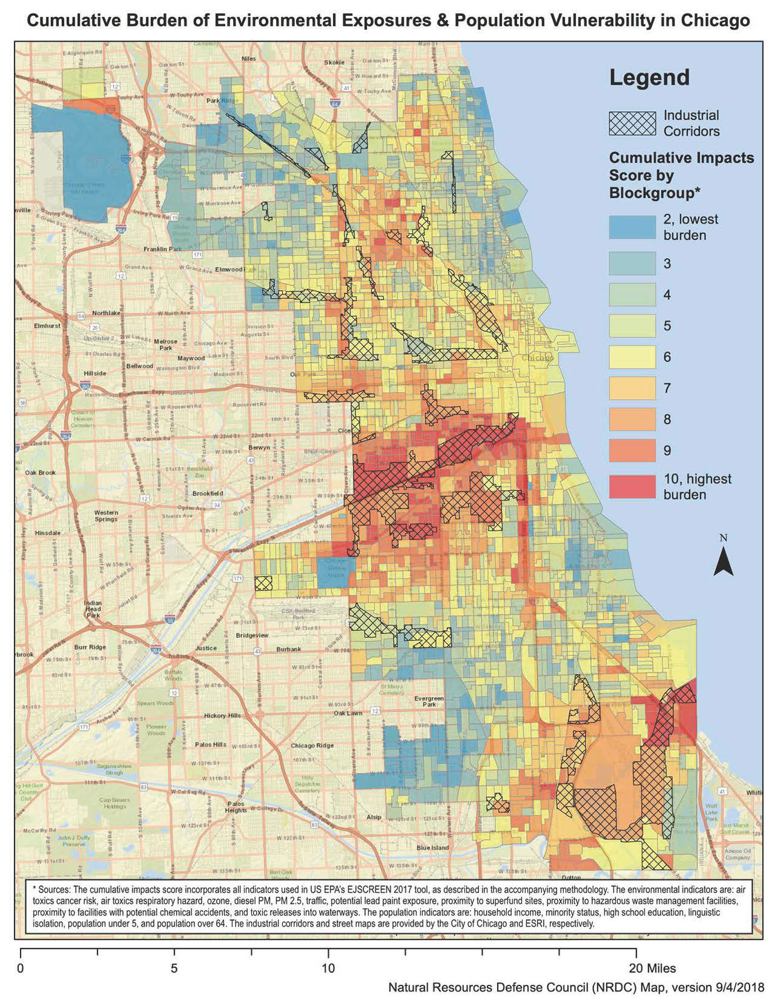

```{r setup, include=FALSE}
knitr::opts_chunk$set(echo = TRUE)
```

COVID-19 has generated a large discussion around pollution. [The Tribune](https://www.chicagotribune.com/news/environment/ct-met-covid-chicago-air-quality-20200514-rqam273qqfbmnfsyn3vzm4f45e-story.html) did a story on PM 2.5 levels apparently going *up* since the stay at home order was announced. [Curious City attempted to answer a question from a listener](https://www.wbez.org/stories/has-the-stay-at-home-order-improved-chicagos-air-quality/3503e93f-53ab-4b1c-beb8-c24ac7ea2534) on this issue. Car traffic is down, but truck traffic is almost the same.

Now, with a botched Coal Plant demolition in Little Village and environmental justice organizations in McKinley Park calling for the closure of the MAT asphalt plant, there are repeated references to research about pollution levels in various communities on the Southwest Side that need to be clarified.

A good example of this is from [South Side Weekly](https://southsideweekly.com/email-ties-alderman-cardenas-polluter/):

> At the January 16 meeting, a color-coded map created by the Natural Resources Defense Council was displayed, showing graded pollution levels in the city caused by diesel trucks, dusty materials, noxious odors and other environmental hazards. The landscape was bright red in Southwest Side communities and in the often-overlooked Southeast Side, near the Calumet River.

The map that they refer to is this one and the description the author provides is incorrect.

<center>

</center>

Every time I've seen this map it's been explained incorrectly. In my opinion, these incorrect descriptions stem from the political interests of some activists combined with a lack of subject matter expertise. I don't want to get side-tracked by Chicago politics or a discussion about the non-profit industrial complex in this post, so [I've written a post that does that here](http://www.troyhernandez.com/npic-lv).

**With the COVID-19 pandemic ongoing, it's more important than ever to have a proper understanding of this data.**

# US EPA EJ Screen

From the [US EPA's website](https://www.epa.gov/ejscreen):

> In order to better meet the Agency’s responsibilities related to the protection of public health and the environment, EPA has developed a new environmental justice (EJ) mapping and screening tool called EJSCREEN. It is based on nationally consistent data and an approach that combines environmental and demographic indicators in maps and reports.

Essentially, the US EPA EJ Screen puts out a collection of data grading each census tract on a variety of demographic and environmental measures. Those measures are combined and mapped to get a clear understanding of census tract with a disprortionately vulnerable population and/or a disproportionate amount of pollution. While the US EPA has this data available and mapped out, [the interface leaves something to be desired](https://ejscreen.epa.gov/mapper/).

# Chicago

Below are a few different visualtions/aggregations of the US EPA EnviroScreen data for Chicago in 2019. First, let's look at just the environmental indicators.

```{r, cache=TRUE, echo=FALSE}
library(leaflet)
library(sp)
# census_tracts <- readRDS("data/censustracts_IL.Rds")
dat.shiny <- readRDS("data/ChicagoShinyDat_2019.RDS")
dat.shiny.pct <- readRDS("data/ChicagoShinyDatPercentile_2019.RDS")
chicago_tracts <- geojsonio::geojson_read("data/ChicagoCensusTracts.geojson",
                                          what = "sp")
chicago_tracts$EnviroScore <- 0
chicago_tracts$EnviroScorePct <- 0
for(i in 1:length(chicago_tracts)){
  chicago_tracts$EnviroScore[i] <- dat.shiny[which(as.character(dat.shiny$CensusTract) == as.character(chicago_tracts$geoid10[i])), "EnviroScore"]
  chicago_tracts$EnviroScorePct[i] <- dat.shiny.pct[which(as.character(dat.shiny.pct$CensusTract) == as.character(chicago_tracts$geoid10[i])), "EnviroScore"]
}

chicago_tracts$EnvironmentalIndicator <- 0
chicago_tracts$EnvironmentalIndicatorPct <- 0
for(i in 1:length(chicago_tracts)){
  chicago_tracts$EnvironmentalIndicator[i] <- dat.shiny[which(as.character(dat.shiny$CensusTract) == as.character(chicago_tracts$geoid10[i])), "EnvironmentalIndicator"]
  chicago_tracts$EnvironmentalIndicatorPct[i] <- dat.shiny.pct[which(as.character(dat.shiny.pct$CensusTract) == as.character(chicago_tracts$geoid10[i])), "EnvironmentalIndicator"]
}

chicago_tracts$DemographicIndicator  <- 0
chicago_tracts$DemographicIndicatorPct <- 0
for(i in 1:length(chicago_tracts)){
  chicago_tracts$DemographicIndicator[i] <- dat.shiny[which(as.character(dat.shiny$CensusTract) == as.character(chicago_tracts$geoid10[i])), "DemographicIndicator"]
  chicago_tracts$DemographicIndicatorPct[i] <- dat.shiny.pct[which(as.character(dat.shiny.pct$CensusTract) == as.character(chicago_tracts$geoid10[i])), "DemographicIndicator"]
}

```

## Environmental Indicator Map

The following 11 environmental indicators are combined in a reasonable way to create an aggregated environmental indicator:

1. National Scale Air Toxics Assessment Air Toxics Cancer Risk
2. National Scale Air Toxics Assessment Respiratory Hazard Index
3. National Scale Air Toxics Assessment Diesel PM (DPM)
4. Particulate Matter (PM2.5)
5. Ozone
6. Lead Paint Indicator
7. Traffic Proximity and Volume
8. Proximity to Risk Management Plan Sites
9. Proximity to Treatment Storage and Disposal Facilities
10. Proximity to National Priorities List Sites
11. Proximity to Major Direct Water Dischargers

**A higher score/more red tract means more pollution.**

```{r, echo=FALSE, warning=FALSE, message=FALSE}
library(leaflet)
pal <- leaflet::colorNumeric("RdBu", domain = c(min(chicago_tracts$EnvironmentalIndicator),
                                       max(chicago_tracts$EnvironmentalIndicator)),
                    reverse = TRUE)
pal2 <- leaflet::colorNumeric("RdBu", domain = c(min(chicago_tracts$EnvironmentalIndicatorPct),
                                       max(chicago_tracts$EnvironmentalIndicatorPct)), reverse = TRUE)

leaflet(chicago_tracts) %>%
  addTiles(group = "EnvironmentalIndicator") %>%
  addTiles(group = "EnvironmentalIndicatorPct") %>%
  addPolygons(stroke = FALSE, smoothFactor = 0.3, fillOpacity = .75,
              fillColor = ~pal(EnvironmentalIndicator),
              label = ~paste0("EnvironmentalIndicator: ", round(EnvironmentalIndicator, 2)),
              group = "EnvironmentalIndicator") %>%
  addPolygons(stroke = FALSE, smoothFactor = 0.3, fillOpacity = .75,
              fillColor = ~pal2(EnvironmentalIndicatorPct),
              label = ~paste0("EnvironmentalIndicatorPct: ", round(EnvironmentalIndicatorPct, 2)),
              group = "EnvironmentalIndicatorPct") %>%
  addLegend(pal = pal, values = ~(chicago_tracts$EnvironmentalIndicator), opacity = 1.0,
            title = "EnvironmentalIndicator", group = "EnvironmentalIndicator") %>%
  addLegend(pal = pal2, values = ~(chicago_tracts$EnvironmentalIndicatorPct), opacity = 1.0,
            title = "EnvironmentalIndicator (%)", group = "EnvironmentalIndicatorPct") %>%
  addLayersControl(
    baseGroups = c("EnvironmentalIndicator", "EnvironmentalIndicatorPct"),
    options = layersControlOptions(collapsed = FALSE)
  )
```


**Caution: Technical Details**: *Census tracts are ranked for each environmental indicator, a resulting percentile score is found for each tract, and the percentile scores are then averaged. This results in the EnvironmentalIndicator score for each tract. If we then rank and derive the percentile scores of the Environmental Indicator, we get the EnvironmentalIndicatorPct.*

What you should take away from this map is that the most polluted areas in the city (according to this metric) tend to be the most trafficked; expressways, downtown. So the most polluted census tracts are parts of the Loop, the West Loop, and Bridgeport. With the COVID-induced reduction of car traffic in these areas, I imagine these are the areas that have experienced the biggest increase in air quality.

You should also notice the *EnvironmentalIndicator* and *EnvironmentalIndicatorPct* buttons in the lower right. *EnvironmentalIndicator* is the raw score. That's approximately the amount of pollution you'll experience if you were standing in that tract. *EnvironmentalIndicatorPct* is how the tracts compare to each other. The worst tract gets a 1. The best tract gets a 0. For this reason, *EnvironmentalIndicatorPct* has more contrast.

## Demographic Indicator Map

The following 6 demographic indicators are combined in a reasonable way to create an aggregated demographic indicator:

1. Percent low-income
2. Percent minority
3. Less than high school education
4. Linguistic isolation
5. Individuals under age 5
6. Individuals over age 64

**A higher score means a more vulnerable population.**

```{r, echo=FALSE, warning=FALSE}
pal <- colorNumeric("RdBu", domain = c(min(chicago_tracts$DemographicIndicator),
                                       max(chicago_tracts$DemographicIndicator)),
                    reverse = TRUE)
pal2 <- colorNumeric("RdBu", domain = c(0, 1), reverse = TRUE)

leaflet(chicago_tracts) %>%
  addTiles(group = "DemographicIndicator") %>%
  addTiles(group = "DemographicIndicatorPct") %>%
  addPolygons(stroke = FALSE, smoothFactor = 0.3, fillOpacity = .75,
              fillColor = ~pal(DemographicIndicator),
              label = ~paste0("DemographicIndicator: ", round(DemographicIndicator, 2)),
              group = "DemographicIndicator") %>%
  addPolygons(stroke = FALSE, smoothFactor = 0.3, fillOpacity = .75,
              fillColor = ~pal2(DemographicIndicatorPct),
              label = ~paste0("DemographicIndicatorPct: ", round(DemographicIndicatorPct, 2)),
              group = "DemographicIndicatorPct") %>%
  addLegend(pal = pal, values = ~(chicago_tracts$DemographicIndicator), opacity = 1.0,
            title = "DemographicIndicator", group = "DemographicIndicator") %>%
  addLegend(pal = pal2, values = ~(chicago_tracts$DemographicIndicatorPct), opacity = 1.0,
            title = "DemographicIndicator (%)", group = "DemographicIndicatorPct") %>%
  addLayersControl(
    baseGroups = c("DemographicIndicator", "DemographicIndicatorPct"),
    options = layersControlOptions(collapsed = FALSE)
  )
```

**Caution: Technical Details**: *Census tracts are ranked for each demographic indicator, a resulting percentile score is found for each tract, and the percentile scores are then averaged. This results in the DemogrpahicIndicator score for each tract. If we then rank and derive the percentile scores of the Demographic Indicator, we get the DemographicIndicatorPct.*

What you should take away from this map is that the most vulnerable populations in the city live on the West, Southwest, and South sides. Downtown and the Northside have some of the least vulnerable populations.

Again, if you click on the *DemographicIndicatorPct* button you'll notice the contrast inreases.

## The EnviroScore

If we combine the Environmental and Demographic Indicators in a reasonable way, we get an Environmental Justice Score, or EnviroScore.

**A higher score means a more vulnerable population in a more polluted neighborhood.**

```{r, echo=FALSE, warning=FALSE}
pal <- colorNumeric("RdBu", domain = c(min(chicago_tracts$EnviroScore),
                                       max(chicago_tracts$EnviroScore)),
                    reverse = TRUE)
pal2 <- colorNumeric("RdBu", domain = c(0, 1), reverse = TRUE)

leaflet(chicago_tracts) %>%
  addTiles(group = "EnviroScore") %>%
  addTiles(group = "EnviroScorePct") %>%
  addPolygons(stroke = FALSE, smoothFactor = 0.3, fillOpacity = .75,
              fillColor = ~pal(EnviroScore),
              label = ~paste0("EnviroScore: ", round(EnviroScore, 2)),
              group = "EnviroScore") %>%
  addPolygons(stroke = FALSE, smoothFactor = 0.3, fillOpacity = .75,
              fillColor = ~pal2(EnviroScorePct),
              label = ~paste0("EnviroScorePct: ", round(EnviroScorePct, 2)),
              group = "EnviroScorePct") %>%
  addLegend(pal = pal, values = ~(chicago_tracts$EnviroScore), opacity = 1.0,
            title = "EnviroScore", group = "EnviroScore") %>%
  addLegend(pal = pal2, values = ~(chicago_tracts$EnviroScorePct), opacity = 1.0,
            title = "EnviroScore (%)", group = "EnviroScorePct") %>%
  addLayersControl(
    baseGroups = c("EnviroScore", "EnviroScorePct"),
    options = layersControlOptions(collapsed = FALSE)
  )
```

**Caution: Technical Details**: *Census tract DemographicIndicatorPct are multiplied by the EnvironmentalIndicatorPct. If we then rank and derive the percentile scores of the EnviroScore, we get the EnviroScorePct.*

What you should take away here is that the Southwest side has *both* a disproportionately vulnerable population and a disproportionate amount of pollution.

Again, if you click on the *EnviroScorePct* button in the you'll notice the contrast inreases... and it's this version of the map that many activists have been showing to people.

# Conclusions

It's always a good time to have a clear understanding of our city. When someone asserts that the southwest side is the most polluted in the city, that's not quite right in normal times... in a pandemic, who knows.?  In the middle of an emergency it's important to know where our most vulnerable populations live. **These two things are not the same.**

The world is complicated and it's hard enough to understand it. Add in a pandemic and it's even harder. Boiling down 17 metrics into 1 provides a helpful lens through which to view our city. It's important to understand what that lens is showing us. Moreover, it's not the only lens through which to see these things. We should remember that.

<center>

</center>

The code that generates the maps and this page are available [here.](https://github.com/TroyHernandez/CHI_EJ_map)  It is based on [my previous volunteer work](https://github.com/TroyHernandez/IL_EJ_map) for the IL EPA, the Illinois Power Agency, and the [Future Jobs Energy Act](https://www.illinois.gov/sites/ipa/Pages/Renewable_Resources.aspx).

