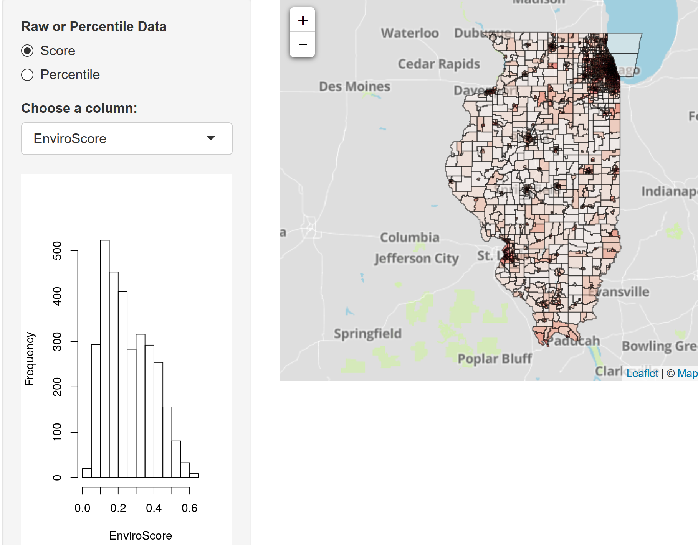
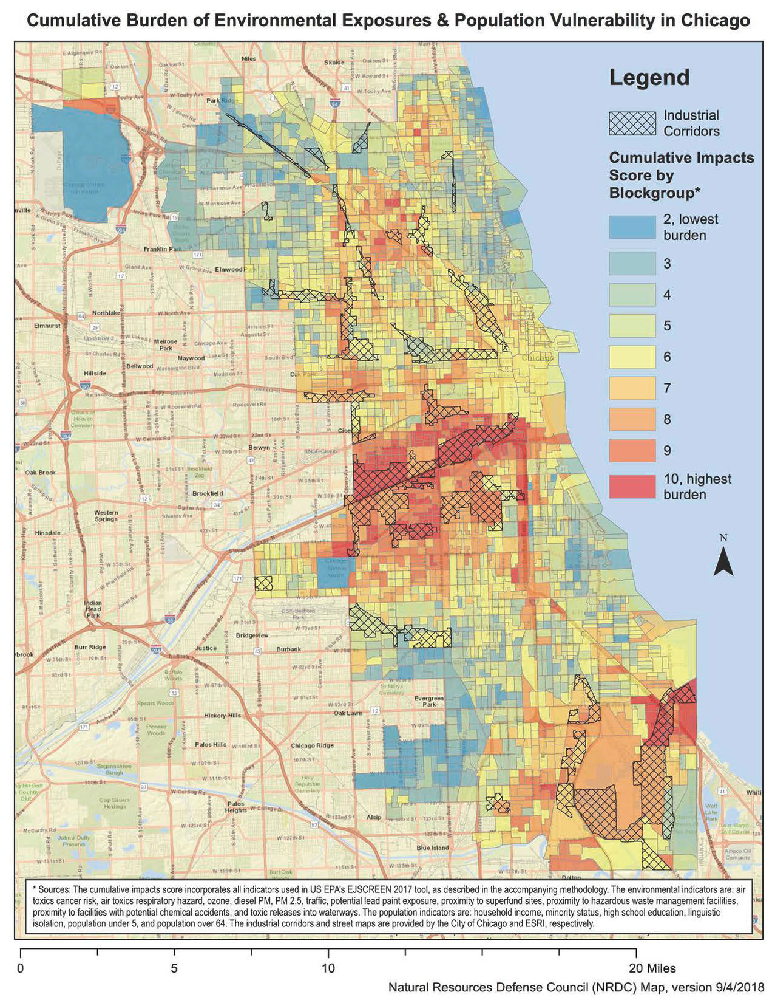
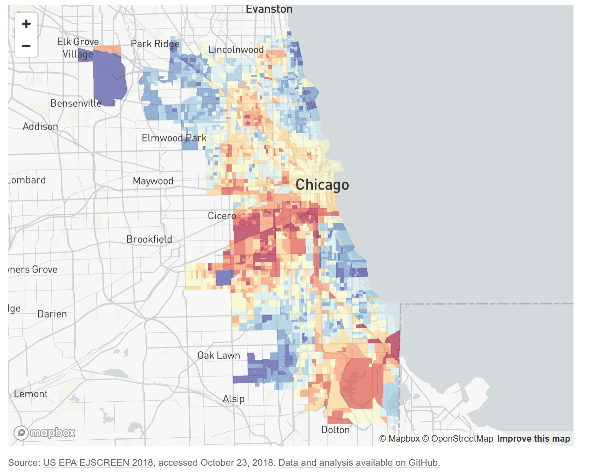
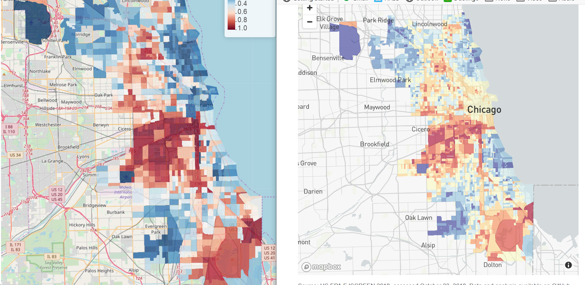
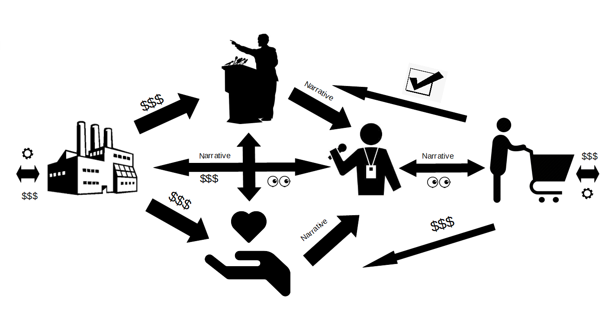

  
```{r setup, include=FALSE}
knitr::opts_chunk$set(echo = TRUE)
```

Back in 2017, I attended a meeting of the Illinois EPA's Environmental Justice (EJ) commission on behalf of the EJ group in Pilsen that I volunteer with, [PERRO](http://pilsenperro.org/). A new law in Illinois, the [Future Energy Jobs Act](https://www.futureenergyjobsact.com/), was discussed. Part of the law set aside some money for EJ communities as defined by the law. Someone raised the issue that no one had taken the time to figure out to which census tracts in the state some parts of the law applied. I was familiar with the data that the law used. [I'd analyzed it before](https://troyhernandez.com/2014/04/02/poverty-pollution-and-race-in-california/). I offered that not only could I calculate which census tracts the law applied to, but I could also make it into an interactive map!

In addition to volunteering for PERRO, I'm also one of the co-organizers for the Chicago R User Group (CRUG) and [just prior to this IL EPA meeting, I had seen Gene Leynes do a presentation on making maps](https://www.meetup.com/Chicago-R-User-Group/events/243491023/). Gene is a co-organizer of CRUG as well as "a data scientist for the City of Chicago working on smart city projects that use predictive analytics to optimize city operations".

A couple of weeks later, I got some time and was able to complete this volunteer effort. I received some nice "thank you" emails from an IL EPA employee and the chair of the commission/LVEJO executive director, Kim Wasserman. I posted the map to Facebook with little fanfair. [The code that generates the map](https://github.com/TroyHernandez/IL_EJ_map/) was and remains publicly available. [The interactive map](https://troyhernandez.shinyapps.io/IL_EJ_map/) was and remains publicly available.

<center>

</center>

You can imagine my surprise when, 11 months after I made my map publicly available, [a press release by the NRDC](https://www.nrdc.org/experts/meleah-geertsma/new-map-shows-chicago-needs-environmental-justice-reforms) excitedly talked about them creating *their* environmental justice map in conjunction with the same Ms. Wasserman of LVEJO... and seemingly every environmental justice organization in Chicago except PERRO!

<center>

</center>

[This work was picked up and recreated](https://www.bettergov.org/news/interactive-map-pollution-hits-chicagos-west-south-sides-hardest/), **making the appropriate references**, by the Better Government Association.

<center>

</center>

At the time I was running [my aldermanic campaign](https://troyhernandez.com/2019-aldermanic-run/) and didn't have time to dig in and see what the difference was between this map and the one I provided pro bono to the IL EPA EJ Commission. It was even more frustrating when one of my political opponents started sending out campaign mailers featuring this map, despite having done little to no previous environmental work in the community. (Protip: Politicians aren't the most honest people.)

# Engage

After the election, I took some time to finally dig into the details of the NRDC press release. As I had suspected the map was largely the same as the one that I had provided a year prior to Ms. Wasserman and the IL EPA, with a few slight changes:

1. the map used just Chicago data, not all of Illiois
2. the color scheme was red/blue instead of red/white
3. while **all 17 of the variables used are identical**, there are slight arithmetic differences in how those variables were combined.

I quickly deleted the non-Chicago census tracts on my map and changed the color scheme to see how different these maps were; i.e. making the above changes 1 and 2. They were almost identical.

<center>

</center>

I was frustrated that not only were PERRO and I excluded from the project, we weren't even referenced! While this work isn't ground-breaking enough to merit a Nobel Prize, using someone's work without reference is immoral. As another CRUG co-organizer, Justin Shea, wrote in a private discussion:

> In academia, not citing one’s sources is called plagiarism. It is considered one of the gravest sins because it robs the credit bestowed upon the original thinker, which serves as motivation for every creator that comes after them. This is also the lifeblood of Open Source as one publicizes their work in an environment in which one can be rewarded by receiving recognition and gratitude from current and future developers and build a deep store of social credit... The value of open source to its creator is almost proportionate to the number of people which use their work and credit attributed back to them... So in a real way, taking and rebranding others' work in open source is akin to stealing...

Open source software (OSS) and collaboration runs much of the digital world that we live in. In relying on social credit, its culture is not that different from academia or activsm. That's why I've found this behavior bad enough to merit a discussion.

*If you'd like to learn more about OSS, [go here](https://opensource.org/community).*

## Air Quality and Health Meeting

A short time later, I attended a meeting that the city's EJ groups were holding with Rahm's city officials in their last days in office. I was surprised to find out that this map was one of the main topics of conversation! When the presenter started explaining my work back to me incorrectly, I started asking questions. Before I could get too far Ms. Wasserman interjected, "*Troy was instrumental in this work!*" Okay :| It was nice to finally be acknowledged, but it got me thinking... **If I was so instrumental in this work, why isn't my name anywhere on it?** I was forced to leave the meeting early, but that was probably for the best.

# NPIC

After some contemplation, I found that this strange, annoying, and disappointing behavior was best understood in the context of the non-profit industrial complex (NPIC). The NPIC is a concept that I've explored previously in an effort to understand why [another local non-profit was selling out the community](https://troyhernandez.com/2014/10/17/pilsens-non-profit-industrial-complex/). The best description of the NPIC I've found is from [INCITE!](https://incite-national.org/books/):

> a system of relationships between the state, the owning classes, foundations, social service and social justice organizations that results in the surveillance, control, derailment, and everyday management of political movements. 

In practice, how do these relationships affect our neighborhood organizations? [Ceema Samimi](https://www.racialequitytools.org/resourcefiles/2010NPIndudtrialComplex.pdf), social worker and researcher, explains it well:

> [the NPIC] forces nonprofits to professionalize, wherein they must focus on maintaining their funding sources rather than fulfilling their mission.

> When organizations participate in the NPIC and perpetuate this cycle of sacrificing mission for funding, they disenfranchise their constituents. Such organizations become more concerned with remaining in business, and goals rooted in social justice become of secondary importance."

With this framework laid out, let's apply it to this situation concretely. Why exclude myself and PERRO from a project where I've already done most of the work?

## $$$

For starters, it took me about 8 hours to do the Illinois EJ map. It took me exactly 80 minutes to convert the IL map into the Chicago one. It took LVEJO and the NRDC 8 months.

The NRDC and LVEJO (and other non-profits) likely got grant money for this project. Why were they so generous with all of the other EJ non-profits and being stingy with PERRO? Well... it took me 80 minutes to make the slight modifications to my map. How much grant money do you think is available for 80 minutes of work? Probably not much. So we couldn't be included.

## Politics

My map and the associated data was available almost a full year before Chicago's 2019 municipal elections.  But Rahm was mayor at the time and in spite of his [terrible environmental record](https://chicago.suntimes.com/2019/2/22/18362156/under-mayor-rahm-emanuel-city-has-sharply-scaled-back-environmental-enforcement), [Ms. Wasserman was the face of his reelection campaign in 2015](https://www.nbcchicago.com/news/local/rahm-drops-first-tv-spot-of-re-election-campaign/89125/)! Some in the community have suggested that this endorsement was the result of a quid pro quo from [Ms Wasserman individually being awarded $175,000](https://www.goldmanprize.org/recipient/kimberly-wasserman/) from some of the Mayor's allies. Whatever the reason for the endorsement, there's clearly a relationship there and she didn't want to have Rahm bearing responsibility for undoing any of the damage he did. That's the next mayor's problem!

Moreover, providing me with any of that social capital would've provided a boost to my underfunded aldermanic campaign. Again, the NPIC "results in the surveillance, control, derailment, and everyday management of political movements" and, as you can tell from reading this blog, my campaign was clearly not the first choice of those who would wish to control the city's political movements.


# The Boy Who Cried Wolf

The ramifications of this tangled NPIC social network are many. The average consumer of news gets a distorted view of the world; they see these non-profits as selfless, brave Davids taking on Goliath. In reality, these "Davids" are taking home [a decent salary](https://projects.propublica.org/nonprofits/organizations/364259477) to do this "work". Journalists in need of content, some with a similarly naive understanding of the non-profit industry, become reliant on these organizations as a source of on-the-ground "truth".

One of the most troublesome aspects of the NPIC are, again, "the surveillance, control, derailment, and everyday management of political movements". The most salient example of this today involves the on-going Tara Reade allegations against Joe Biden. Tara Reade took her case to Time's Up, the non-profit formed to provide legal assistance to #MeToo whistleblowers. ["Time’s Up Said It Could Not Fund a #MeToo Allegation Against Joe Biden, Citing Its Nonprofit Status and His Presidential Run"](https://theintercept.com/2020/03/24/joe-biden-metoo-times-up/).

In Chicago, [politicians aware of the NPIC social network will take criticism from these organizations with deserved skepticism](https://news.wttw.com/2020/05/13/environmental-fight-underscores-covid-19-concerns-mckinley-park). When Ms. Wasserman and LVEJO call for our new Mayor Lightfoot to reinstitute the [the Environment Department that Rahm dismantled](https://www.chicagobusiness.com/article/20111013/NEWS02/111019914/chicago-shutting-environment-department-adding-eco-friendly-measures-to-new-budget) as they did at several meetings I attended just before Mayor Lightfoot took office, it rightly comes off as pure politicking. If the Environment Department was so important, why did Ms. Wasserman endorse Rahm after he dismantled it? [Why don't reporters ask about this curious flip-flop?](https://en.wikipedia.org/wiki/Manufacturing_Consent)

<center>

</center>

When LVEJO talked about, ["the grim reality of how dangerous [the Hilco] demolition and remediation process really is"](https://lavillitarespira.com/updates/winter-2020/) at the start of the year, it came off as an equally disingenuous action. Who was responsible for the Hilco project, but the Mayor who [bragged about never losing a vote in city council](https://chicago.suntimes.com/news/2019/4/26/18623352/emanuel-has-no-regrets-over-not-ousting-burke-from-power-8-years-ago), Mayor Emanuel?

But even a broken clock is right twice a day. [On April 11th, the Crawford Coal plant in Little Village was improperly demolished, leaving a neighorhood with respiratory issues coated in dust in the middle of a pandemic.](https://news.wttw.com/2020/04/12/city-clampdown-coal-plant-demolition-too-little-too-late)

This is the true danger of the NPIC. When non-profits become partisan political actors, the neighborhoods lose an advocate's voice. And the next time that partisan cries wolf, their opponents, should they be in power, won't be listening.
